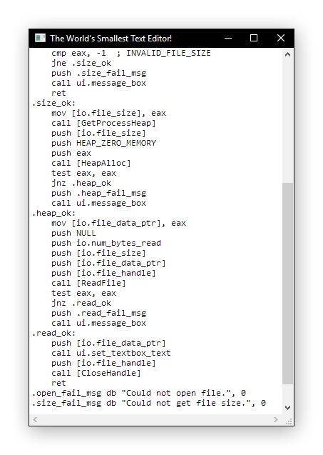

# What is this?

...

## How small is it?

Using the included make-script (which uses [fasm](https://flatassembler.net/) for assembly and linking), the executable is 3072 bytes.

## Building

### Prerequisites
* [Python 3](https://www.python.org/downloads/)

### Instructions
1. Clone this repository: `git clone https://github.com/philiparvidsson/Worlds-Smallest-Text-Editor`
2. Run the make-script: `python make.py`  
   <i><b>&nbsp;&nbsp;&nbsp;&nbsp;NOTE:</b> The make script will automatically download [fasm](https://flatassembler.net/) to the repository directory.</i>

## Running
1. Build the program.
2. Run it normally or start it with the make-script: `python make.py run`
